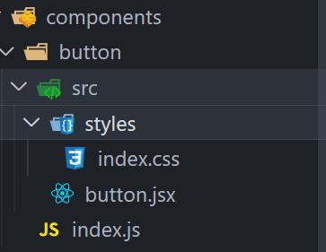

# react 组件开发

## 1. create-react-app 创建项目

```sh
npx create-react-app my-react-components-js
```

等待创建完成用 vscode 打开

```sh
code ./my-react-components-js
```

运行项目看看是否成功，不成功重新创建

```sh
npm run start
```

显示如下成功

```sh
Compiled successfully!

You can now view my-react-components-js in the browser.

  http://localhost:3000

Note that the development build is not optimized.
To create a production build, use npm run build.

webpack compiled successfully
```

## 2.开发组件

### 新建组件文件夹

```sh
mkdir ./src/components
```

### 开发Button组件

```sh
mkdir ./src/components/Button
```

## 新建如下文件



- index.css

  ```css
  .my-btn {
    outline: none;
    padding: 0;
    margin: 0;
    border: none;
    color: #fff;
  }
  
  .my-btn-bg-warn{
    background: #f1c40f;
  }
  
  .my-btn-bg-warn:hover{
    background: #ecc00f;
    color: #ebeff1;
  }
  
  .my-btn-bg-warn:active{
    background: #e1b60c;
    color: #d3d9dd;
  }
  
  .my-btn-bg-success{
    background: #2ecc71;
  }
  
  .my-btn-bg-success:hover{
    background: #2dc66d;
    color: #ebeff1;
  }
  
  .my-btn-bg-success:active{
    background: #27ae60;
    color: #d3d9dd;
  }
  
  .my-btn-bg-primary{
    background: #3498db;
  }
  
  .my-btn-bg-primary:hover{
    background: #238acf;
    color: #dce1e4;
  }
  
  .my-btn-bg-primary:active{
    background: #2980b9;
    color: #bdc3c7;
  }
  
  .my-btn-size-default {
    padding: 6px 10px;
    font-size: 16px;
    border-radius: 4px;
  }
  
  .my-btn-size-small {
    padding: 4px 6px;
    font-size: 14px;
    border-radius: 3px;
  }
  
  .my-btn-size-mini {
    padding: 3px 4px;
    font-size: 12px;
    border-radius: 2px;
  }
  
  .my-btn-size-large {
    padding: 8px 12px;
    font-size: 18px;
    border-radius: 5px;
  }
  ```

- button.jsx

  ```jsx
  import './styles/index.css';
  
  const btnPrefix = 'my-btn';
  const sizePrefix = btnPrefix + '-size';
  const typePrefix = btnPrefix + '-bg';
  
  const sizeEnum = {
    mini: 'mini',
    small: 'small',
    default: 'default',
    large: 'large',
  };
  
  const typeEnum = {
    primary: 'primary',
    success: 'success',
    warn: 'warn',
  };
  
  const getSize = size => sizeEnum[size] || sizeEnum.default;
  
  const getType = type => typeEnum[type] || typeEnum.primary;
  
  const Button = props => {
    const { size, type, onClick } = props;
    return (
      <button
        {...props}
        onClick={onClick}
        className={`${btnPrefix} ${sizePrefix + '-' + getSize(size)} ${
          typePrefix + '-' + getType(type)
        }`}
      >
        {props.children}
      </button>
    );
  };
  
  export default Button;
  ```

- index.js

  ```js
  export {default as Button} from "./src/button"
  ```

### 新建组件出口文件并写入内容

```sh
echo '' >> ./src/components/index.js
```

```js
export { Button } from './button';
```

## 配置rollup

### 安装相关插件

```sh
npm i -D rollup @rollup/plugin-node-resolve @rollup/plugin-babel @babel/core @babel/cli @babel/preset-env @babel/preset-react rollup-plugin-postcss @babel/plugin-transform-runtime @rollup/plugin-terser 
```

### 新建配置文件 根目录

/rollup.config.mjs

```js
import { defineConfig } from 'rollup';
import resolve from '@rollup/plugin-node-resolve';
import babel from '@rollup/plugin-babel';
import postcss from 'rollup-plugin-postcss';
import fs from 'fs';
import terser from '@rollup/plugin-terser';

export default defineConfig({
  input: './src/components/index.js', // 入口
  treeshake: false, // 关闭treeshake
  external: [/node_modules/], // 不打包node_modules模块
  plugins: [
    resolve({
      extensions: ['.js', '.jsx', '.json', '.mjs', '.node'],
    }),
    babel({
      babelHelpers: 'runtime',
      exclude: 'node_modules/**',
      extensions: ['.js', '.jsx', '.mjs', 'json'],
    }),
    postcss({ extract: true }), // 出来css
    // 清理输出目录
    {
      name: 'clean-output',
      outputOptions(options) {
        if (fs.existsSync(options.dir)) {
          clearDir(options.dir);
        }
      },
    },
  ],
  output: [
    //输出
    {
      exports: 'auto',
      format: 'esm', // 打包格式
      dir: 'es', // 输出目录
      preserveModules: true, // 保持文件位置
      preserveModulesRoot: './src/components/', // 打包根目录
    },
    {
      exports: 'auto',
      format: 'cjs',
      dir: 'lib', // 输出目录
      preserveModules: true,
      preserveModulesRoot: './src/components/',
    },
    {
      name: 'asd', // 全局变量名
      format: 'umd',
      dir: 'dist',
      entryFileNames: '[name].js',
      plugins: [terser()],
    },
  ],
});

function emptyDir(path) {
  const files = fs.readdirSync(path);
  files.forEach(file => {
    const filePath = `${path}/${file}`;
    const stats = fs.statSync(filePath);
    if (stats.isDirectory()) {
      emptyDir(filePath);
    } else {
      fs.unlinkSync(filePath);
    }
  });
}

function rmEmptyDir(path, level = 0) {
  const files = fs.readdirSync(path);
  if (files.length > 0) {
    let tempFile = 0;
    files.forEach(file => {
      tempFile++;
      rmEmptyDir(`${path}/${file}`, 1);
    });
    if (tempFile === files.length && level !== 0) {
      fs.rmdirSync(path);
    }
  } else {
    level !== 0 && fs.rmdirSync(path);
  }
}

function clearDir(path) {
  emptyDir(path);
  rmEmptyDir(path);
}
```

/babel.config.json

```json
{
  "presets": [
    [
      "@babel/preset-env",
      {
        "modules": false
      }
    ],
    "@babel/preset-react"
  ],
  "plugins": [["@babel/plugin-transform-runtime"]],
  "ignore": ["node_modules/**"]
}
```

## 打包

``` sh
npx rollup -c
```

会生成三个文件夹lib es dist

/package.json 中新增

```json
 "peerDependencies": {
    "react": "^18.2.0",
    "@babel/runtime": "^7.20.13"
  },
  "main": "./lib/index.js",
  "module": "./es/index.js",
  "files": [
    "dist",
    "es",
    "lib",
    "README.md"
   ],
```

然后将*private*：true 删掉

npm 发布自己的包

```sh
npm publish
```

## 测试包

安装你自己发布的包名 最好不要换源安装，其他源有延时

``` sh
npm i my-react-components-js
```

### App.js 导入自己的包运行

```jsx
import { Button } from 'my-react-components-js/lib';
import 'my-react-components-js/es/index.css';

function App() {
  return (
    <>
      <Button
        size="large"
        type="success"
        onDoubleClick={e => {
          console.log(e);
        }}
      >
        button
      </Button>
    </>
  );
}

export default App;
```

测试成功：


